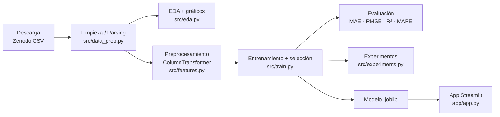
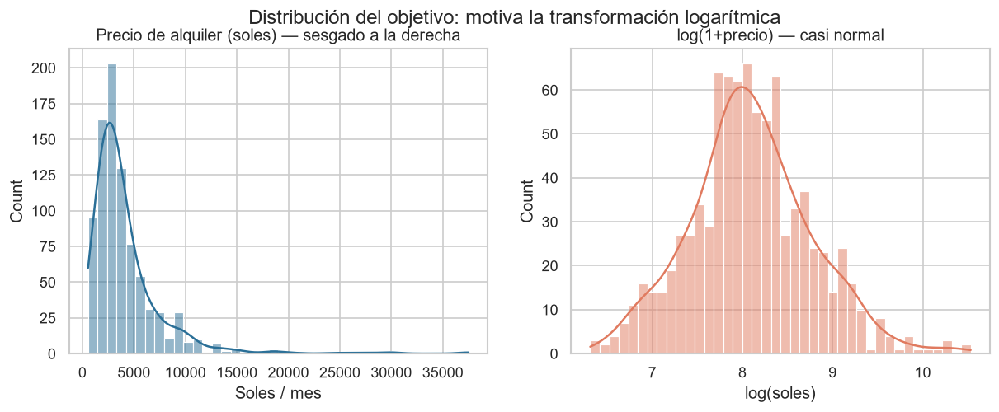
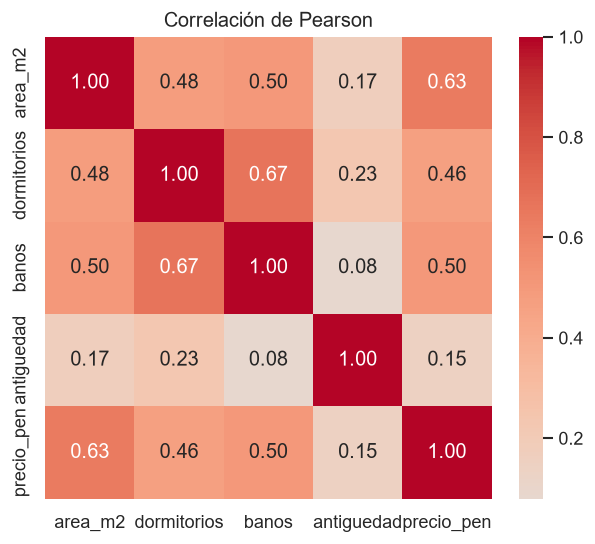
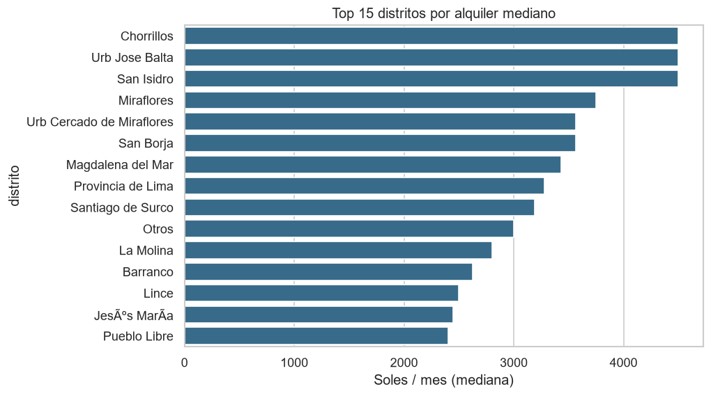
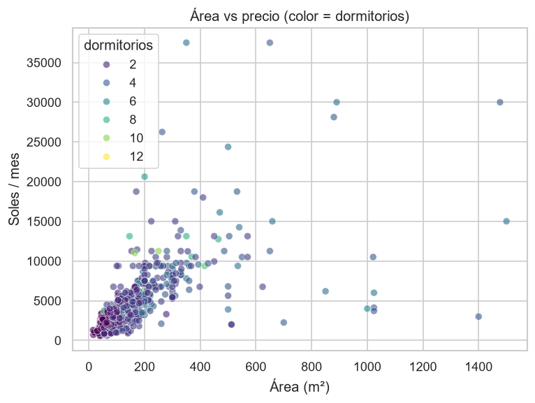
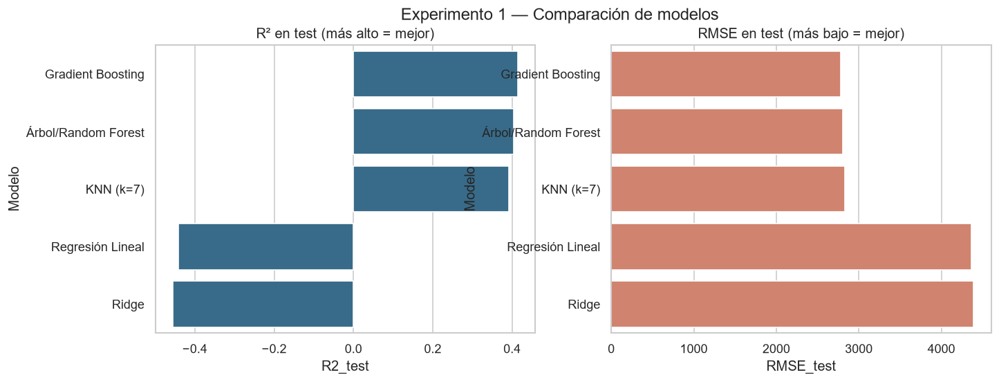
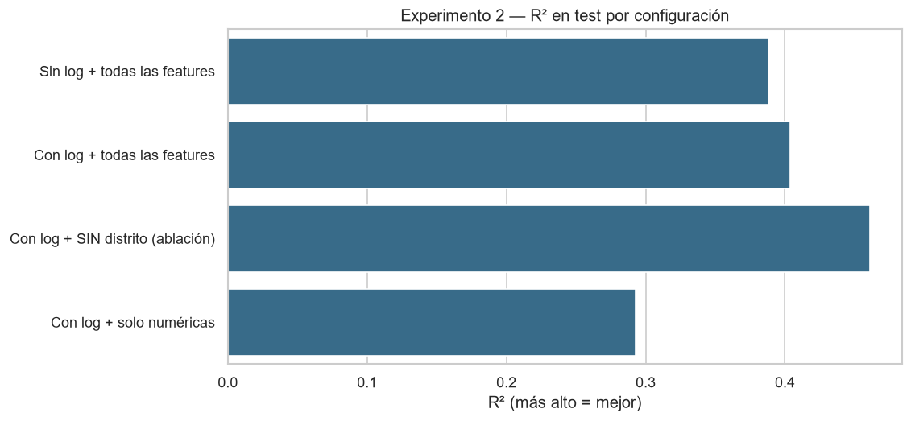
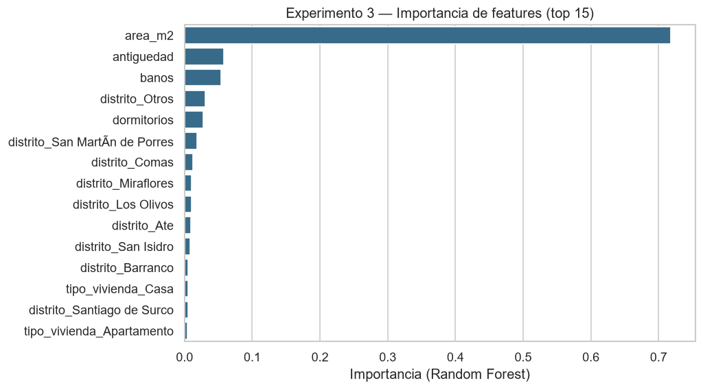
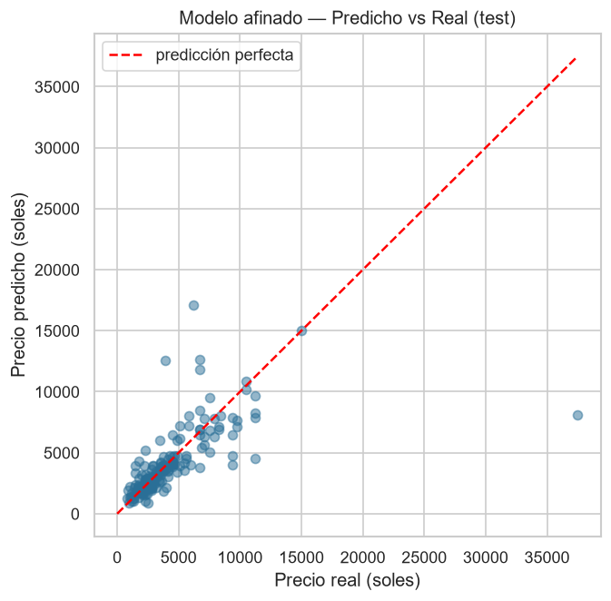
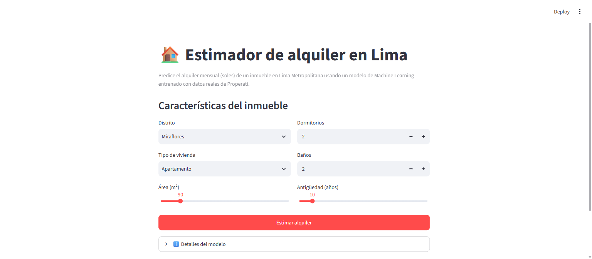

# 🏠 Predicción de precios de alquiler en Lima con Machine Learning

Proyecto final del curso de **Inteligencia Artificial** — Ingeniería de Software,
Universidad La Salle (Arequipa). Predice el **alquiler mensual (en soles)** de un
inmueble en Lima Metropolitana a partir de sus características, usando un pipeline
completo de Machine Learning con **Scikit-learn** y una app web en **Streamlit**.

> **Técnica principal:** Machine Learning supervisado — **regresión** con Scikit-learn.

---

## 1. Problema

El mercado de alquiler en Lima es opaco: los precios se publican en **monedas
distintas** (soles y dólares), sin estandarizar, y un inquilino o propietario no
tiene una referencia objetiva de cuánto debería costar un inmueble con ciertas
características. 

**Objetivo:** construir un modelo que, dado el **distrito, área, número de
dormitorios y baños, antigüedad y tipo de vivienda**, estime el alquiler mensual
esperado. Es un problema de **regresión** (la variable objetivo es continua:
soles por mes).

**Utilidad real:** una herramienta orientativa para inquilinos, propietarios y
agentes inmobiliarios; y un ejercicio de cómo el preprocesamiento honesto de
datos sucios reales condiciona el resultado.

---

## 2. Fuente de datos

| Campo | Detalle |
|---|---|
| **Nombre** | *Análisis de alquiler de inmuebles de la ciudad de Lima-Perú a través de la plataforma Properati* |
| **Origen** | Avisos reales del portal inmobiliario **Properati Perú**, recopilados por investigadores y publicados en **Zenodo** |
| **Enlace / DOI** | https://zenodo.org/records/7846211 · DOI [10.5281/zenodo.7846211](https://doi.org/10.5281/zenodo.7846211) |
| **Fecha** | Publicado el **19 de abril de 2023** |
| **Licencia** | **Creative Commons Attribution 4.0 (CC-BY-4.0)** — permite uso y redistribución con atribución |
| **Tamaño** | **1,079 registros × 12 columnas** (~316 KB, CSV) |
| **País** | 🇵🇪 Perú (datos locales, valorados por el enunciado) |

El CSV crudo viene incluido en `data/raw/` (la licencia lo permite) y también
puede **regenerarse desde la fuente oficial** con `python -m src.data`.

> **Atribución:** Enriquez Lira, J. C., & Mucha Morales, F. A. (2023). *Dataset de
> alquiler de inmuebles de Lima vía Properati* (CC-BY-4.0). Zenodo.

---

## 3. Diagrama del pipeline



**Pasos:**
1. **Obtención** — descarga del CSV desde Zenodo (fuente estable con DOI).
2. **Limpieza/parsing** — se extraen números de texto (`"2 dormitorios"→2`,
   `"103 m²"→103`), se **unifica la moneda a soles**, se filtra a Lima y se
   descartan outliers imposibles.
3. **EDA** — distribuciones, correlaciones y precio por distrito.
4. **Preprocesamiento** — imputación + escalado + One-Hot dentro de un
   `ColumnTransformer` (sin fuga de datos).
5. **Modelado** — se comparan 5 algoritmos y se elige el mejor por validación
   cruzada.
6. **Evaluación** — métricas de regresión en un conjunto de prueba *hold-out*.
7. **Aplicación** — app Streamlit que consume el modelo entrenado.

---

## 4. Técnica usada y justificación

**Machine Learning supervisado — regresión con Scikit-learn.**

- **¿Por qué regresión?** La variable objetivo (alquiler en soles) es **continua**,
  por lo que no es clasificación ni clustering. El enunciado la lista explícitamente
  como opción (b) con Scikit-learn.
- **¿Por qué comparar varios modelos?** Para justificar la elección con evidencia:
  desde un **baseline lineal** hasta **modelos de árboles** (Random Forest,
  Gradient Boosting) que capturan relaciones no lineales e interacciones
  (p. ej. área × distrito) sin ingeniería manual.
- **¿Por qué transformar el objetivo con `log(1+precio)`?** El EDA muestra que el
  precio está **fuertemente sesgado a la derecha** (pocos inmuebles de lujo muy
  caros). Modelar en escala logarítmica estabiliza la varianza y mejora las
  métricas (ver Experimento 2). Se implementa con `TransformedTargetRegressor`,
  que **deshace** la transformación al predecir.

---

## 5. EDA (Análisis Exploratorio)

| Distribución del objetivo | Correlaciones |
|---|---|
|  |  |

- El precio es **muy sesgado**; su logaritmo es casi normal → **motiva la
  transformación log**.
- El **área (m²)** es la variable más correlacionada con el precio (r ≈ **0.63**),
  seguida de baños (0.50) y dormitorios (0.46). La antigüedad casi no correlaciona
  linealmente (0.15).

| Precio por distrito | Área vs precio |
|---|---|
|  |  |

Los distritos premium (Miraflores, San Isidro, Barranco, Surco) tienen alquileres
medianos claramente más altos, confirmando que la **ubicación importa**.

---

## 6. Preprocesamiento (decisiones justificadas)

| Decisión | Justificación |
|---|---|
| **Unificar moneda a soles** (USD × 3.75) | El 62 % de avisos están en USD y 38 % en soles; mezclarlos sin convertir haría el objetivo incomparable. Tipo de cambio venta de abril 2023 (BCRP/SBS). |
| **Filtrar a Lima Metropolitana + Callao** | La fuente incluye Arequipa, Piura, etc.; mezclar mercados distintos degrada el modelo. |
| **Parsing con regex** de texto a número | Los campos vienen como `"2 dormitorios"`, `"103 m²"`. |
| **Imputación por mediana** (numéricas) | 183 valores nulos en antigüedad; la mediana es robusta a outliers. |
| **One-Hot de distrito y tipo** con `handle_unknown="ignore"` | Permite que la app tolere distritos no vistos sin fallar. |
| **Agrupar distritos raros como "Otros"** | Evita categorías con 1-2 ejemplos que causan sobreajuste. |
| **Descartar outliers imposibles** | Área < 10 m² o > 2000 m²; precio < S/300 o > S/60,000 (precios de venta mal etiquetados). |
| **Split 80/20 con semilla fija (42)** | Evaluación honesta y reproducible sobre datos no vistos. |

Resultado: **867 filas limpias y modelables** a partir de las 1,079 crudas.

---

## 7. Experimentos y resultados

Todos los experimentos usan el **mismo split** (semilla 42) y métricas de
regresión: **MAE** y **RMSE** en soles, **R²** (varianza explicada) y **MAPE**
(error porcentual). Tablas en `reports/tables/`, figuras en `reports/figures/`.

### Experimento 1 — Comparación de modelos

| Modelo | RMSE_cv | MAE_test | RMSE_test | R²_test | MAPE_test |
|:--|--:|--:|--:|--:|--:|
| **Gradient Boosting** | 2626 | **1150** | **2779** | **0.415** | 26.3 |
| Árbol/Random Forest | **2494** | 1153 | 2806 | 0.404 | 26.3 |
| KNN (k=7) | 2591 | 1320 | 2833 | 0.392 | 28.1 |
| Regresión Lineal | 3286 | 1663 | 4364 | −0.442 | 32.1 |
| Ridge | 3310 | 1663 | 4385 | −0.456 | 31.9 |



**Hallazgo:** los **modelos de árboles** superan ampliamente a los lineales. La
regresión lineal obtiene **R² negativo** (peor que predecir el promedio): no
maneja el sesgo ni las interacciones. Random Forest gana por validación cruzada
(criterio de selección honesto), por lo que es el modelo desplegado.

### Experimento 2 — Transformación log y ablación de features

| Configuración | MAE_test | RMSE_test | R²_test | MAPE_test |
|:--|--:|--:|--:|--:|
| Sin log + todas las features | 1237 | 2843 | 0.388 | 30.0 |
| Con log + todas las features | 1153 | 2806 | 0.404 | 26.3 |
| **Con log + SIN distrito (ablación)** | 1237 | **2667** | **0.461** | 29.3 |
| Con log + solo numéricas | 1337 | 3056 | 0.293 | 32.6 |



**Hallazgos:**
- La **transformación log mejora** el modelo (R² 0.388 → 0.404, MAPE 30 % → 26 %).
- **Sorpresa honesta:** quitar `distrito` *mejora* el R² en test (0.404 → 0.461).
  Con solo 693 filas de entrenamiento, el One-Hot de ~23 distritos genera muchas
  columnas dispersas que el modelo **sobreajusta**. La ubicación sí importa
  (EDA), pero con este tamaño de muestra su codificación cruda aporta más ruido
  que señal. Un *target/zone encoding* lo resolvería (ver Trabajo futuro).
- Usar **solo numéricas** empeora todo → las categóricas sí suman información.

### Experimento 3 — Ajuste de hiperparámetros (GridSearchCV)

Búsqueda en grilla sobre `n_estimators`, `max_depth`, `min_samples_leaf` y
`max_features` del Random Forest (5-fold CV, 36 combinaciones).

| Configuración | MAE | RMSE | R² | MAPE |
|:--|--:|--:|--:|--:|
| Random Forest (default) | 1153 | 2806 | 0.404 | 26 |
| Random Forest (tuned) | 1155 | 2835 | 0.391 | 27 |

**Mejores hiperparámetros:** `max_depth=12, max_features=1.0, min_samples_leaf=1,
n_estimators=300`.

**Hallazgo:** el tuning **no mejora** al modelo por defecto (diferencia dentro del
ruido) — señal de que el techo de desempeño lo pone la **información disponible**,
no los hiperparámetros. La importancia de features confirma que **el área domina**:

| Importancia de features | Predicho vs Real |
|---|---|
|  |  |

---

## 8. Resultados y conclusiones

- El modelo final (**Random Forest** + objetivo log) predice el alquiler con
  **MAE ≈ S/1,150** y **MAPE ≈ 26 %** sobre datos no vistos — razonable para un
  dataset pequeño, ruidoso y con features limitadas.
- El **R² ≈ 0.40** es modesto pero **honesto**: el precio de alquiler depende de
  factores que el dataset no captura (piso, vista, amoblado, cercanía a estaciones,
  estado de conservación).
- Lección central: en datos reales, **el preprocesamiento y el tamaño de muestra
  pesan más que la elección del algoritmo o el tuning**.

---

## 9. Aplicación (Streamlit)

App interactiva que carga el modelo entrenado y estima el alquiler en tiempo real,
con rango de confianza (± error medio) y equivalente en dólares.



```bash
streamlit run app/app.py
```

---

## 10. Estructura del repositorio

```
ia-precios-lima/
├── docs/
│   ├── ENUNCIADO.md                  # enunciado y rúbrica del curso
│   └── RUBRICA_CHECKLIST.md          # cómo se cumple cada criterio + guion
├── data/
│   ├── raw/properati_lima.csv        # dataset crudo (CC-BY-4.0)
│   └── processed/                    # generado por el pipeline
├── notebooks/
│   └── 01_eda.ipynb                  # EDA interactivo
├── src/
│   ├── config.py                     # rutas y constantes (fuente única)
│   ├── data.py                       # descarga desde Zenodo
│   ├── data_prep.py                  # limpieza y parsing
│   ├── eda.py                        # análisis exploratorio + figuras
│   ├── features.py                   # ColumnTransformer (preprocesador)
│   ├── models.py                     # catálogo de modelos + pipeline
│   ├── train.py                      # entrenamiento y selección del mejor
│   ├── evaluate.py                   # métricas de regresión
│   └── experiments.py                # los 3 experimentos
├── app/
│   └── app.py                        # aplicación Streamlit
├── models/                           # modelo entrenado (.joblib)
├── reports/
│   ├── figures/                      # gráficos EDA + experimentos
│   └── tables/                       # tablas de resultados (CSV + MD)
├── requirements.txt
├── run_pipeline.py                   # ejecuta todo de principio a fin
└── README.md
```

---

## 11. Instalación y ejecución

**Requisitos:** Python 3.11+ (probado en 3.13).

```bash
# 1. Clonar y entrar al proyecto
git clone <URL-del-repo>
cd ia-precios-lima

# 2. Crear entorno virtual e instalar dependencias
python -m venv .venv
# Windows:
.venv\Scripts\activate
# Linux/Mac:
source .venv/bin/activate
pip install -r requirements.txt

# 3. Ejecutar TODO el pipeline de principio a fin
python run_pipeline.py

# 4. Lanzar la app
streamlit run app/app.py
```

O paso a paso:

```bash
python -m src.data          # (opcional) redescargar el dataset desde Zenodo
python -m src.data_prep     # limpieza -> data/processed/
python -m src.eda           # EDA -> reports/figures/
python -m src.train         # entrena y guarda el modelo
python -m src.experiments   # corre los 3 experimentos
```

---

## 12. Reproducibilidad

- **Semilla fija** (`RANDOM_STATE = 42`) en split, CV y modelos.
- **Versiones fijadas** en `requirements.txt`.
- **Dataset versionado** en el repo + script de descarga desde la fuente con DOI.
- Todas las constantes (tipo de cambio, filtros, rutas) están centralizadas en
  `src/config.py` — sin números mágicos dispersos.

---

## 13. Limitaciones y trabajo futuro

- **Tamaño de muestra** (867 filas) limita el techo de desempeño.
- **Codificación de ubicación:** probar *target encoding* o agrupar distritos en
  **zonas socioeconómicas** para explotar la señal geográfica sin sobreajustar.
- **Más features:** piso, amoblado, cochera, m² de terreno vs construidos.
- **Intervalos de predicción** formales (regresión cuantílica).

---

## 14. Licencia y créditos

- **Código:** MIT.
- **Datos:** CC-BY-4.0 — Enriquez Lira, J. C. & Mucha Morales, F. A. (2023),
  Zenodo, DOI 10.5281/zenodo.7846211.
- **Autor:** Jerson E. Chura — Curso de Inteligencia Artificial, Universidad La
  Salle (Dr. Machaca Arceda).
